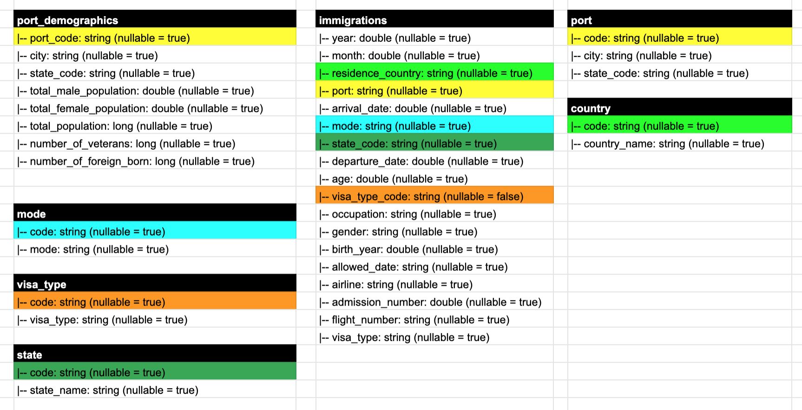

# Capstone Project

## Project Scope
I have opted for Udacity provided project. This project contains four datasets which will be described below. For the purpose of this project, I choose two of those datasets to model a schema that can used by immigration exports to get answers to various questions. For example:
 - From where the immigrants are coming to US.
 - What is the correlation of the favorite destination city and it's demographics.
 - Which is the most favorite city for the immigrants. etc.

## Datasets
The following datasets were included in the project.
- **I94 Immigration Data**: This data comes from the US National Tourism and Trade Office. A data dictionary is included in the workspace.
- **World Temperature Data**: This dataset came from Kaggle.
- **U.S. City Demographic Data**: This data comes from OpenSoft.
- **Airport Code Table**: This is a simple table of airport codes and corresponding cities.

As mentioned above, for the purpose of this project, I used *I94 Immigration Data* and *U.S. City Demographic Data*

## Data Exploration
The Immigration Dataset is a huge one. The data is just for year 2016 divided into 12 file, one for each month. Each file contains around 3 million rows. A data dictionary is included in the workspace called `I94_SAS_Labels_Descriptions.SAS`. It contains defination of various fields in the schema and also helps to understands that dataset. This dictionary can be used to create different dimension tables around the immigration data table. More detials below.
The U.S. demographics data is quite clean and has only around 3 thousand rows. The data has attributes like city and state which can be used to match this data with immigration data.

## Data Model
I have come up with the following data model for this project.

Most of the dimension tables around immigrations fact table are extracted from the labels descriptions file. `i94port` is used to create city and state which is then used to reference attach demographics dataset with the immigations.

## Steps
- I wrote a simple function to parse the contents of i94 labels description file. The function can take the name of the field return a data frame for field code and it's value.
- I used this function to reteive the data for `I94MODE`, `I94VISA`, `I94ADDR`, `I94CIT`, `I94PORT`.
- `I94PORT` is a combination of city and state. So next I splitted this into two field which will later be used to join with other dataset.
- Cleaned up data for `I94MODE`, `I94VISA`, `I94ADDR`, and `I94CIT`. More information in `etl.py`
- I used this city and state to filter the U.S city demographics dataset for these city and state combination and then created a new dimension table for the demographic using the `i94port` as key.
- Note that demographics data for each city and state was divided by `race` column. For the purpose of the project, I have aggregated various columns to based on city and state so the we can easily refer to the city level statistics in the data model.
- Read immigration data into spark dataframe using `.sas7bdat` library.
- Created the final immigration table after removing any invalid/empty reference fields. More details in `etl.py`.
- Stored all thet tables in the destination path in parquet format.

## Data Dictionary
### immigraions
|-- year: 4 digit year 
|-- month: numeric month 
|-- residence_country: i94 country code, refer to `country` table for details 
|-- port: `i94port` code, reference `port` table for details of each code 
|-- arrival_date: date of arrival in U.S. 
|-- mode: code for mode of arrival, see `mode` table for details 
|-- state_code: two letter U.S. state code 
|-- departure_date: departure date from U.S. 
|-- age: age of the immigrant 
|-- visa_type_code: visa type code, refer to `visa` table for details 
|-- occupation: occupation of the immigrant 
|-- gender: gender of immigrant 
|-- birth_year: birth year of immigrant 
|-- allowed_date: Date until the immigrant is allowed to stay in U.S. 
|-- airline: airline code used to arrive in U.S. 
|-- admission_number: admission number 
|-- flight_number: flight number 
|-- visa_type: visa type 

### port_demographics
|-- port_code: `i94port` code 
|-- city: city name 
|-- state_code: two letter sate code 
|-- total_male_population: total male population 
|-- total_female_population: total female population 
|-- total_population: total population 
|-- number_of_veterans: number of veterans 
|-- number_of_foreign_born: number of foreign born 

## Tools and Technologies
Python is used as primary programming language. All the files were parsed using pyspark library as it can handle multiple format and has faster data processing capabilities. `spark-sas7bdat` library was used to parse the SAS file pyspark. Apache spark can handle such large amount of data and can scale as the data size is increased. I used Spark SQL as well to create final immigration and demographics table as I had to join different dataframe together to create the final table and using SQL syntax is a little easier and more readable. The final output was save in parquet format which can be further processed for analytical purposes.

## Addressing Other Scenarios
- **The data was increased by 100x.**
We can use a cluster manager and increase the number of nodes depending on the amount of data.

- **The pipelines would be run on a daily basis by 7 am every day.**
To run the ETL processes daily, we should schedule our etl job either with `Airflow` or some other workflow orchestration frameworks daily at 7 am.

- **The database needed to be accessed by 100+ people.**
The data is available in the parquet format in the output. This data can be further loaded into redshift cluster to access by 100+ people. We can increase the nodes of our redshift cluster ans the number of people increases.

## How to Run
To run this project, you should have I94 Immigration data and all the other datasets located somewhere. Update the `cp.cfg` configration file for each dataset's input and output file paths and then simply run `python etl.py` from the terminal. Note that you have to have pyspark installed on the machine.
